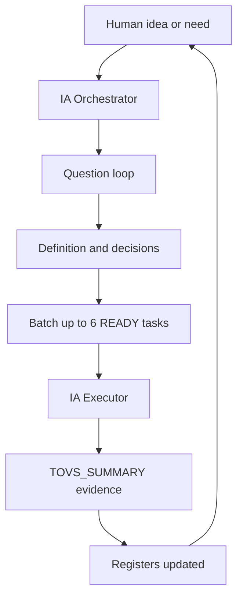
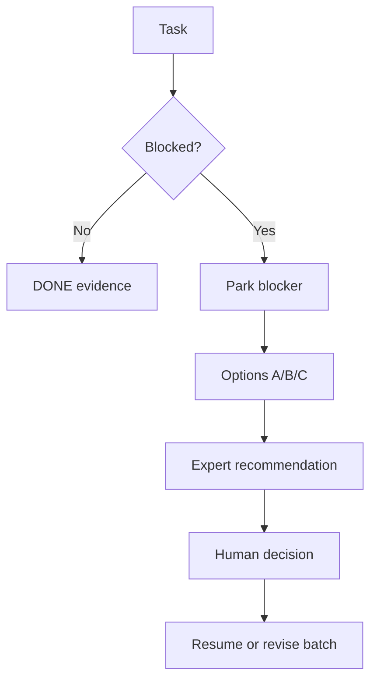
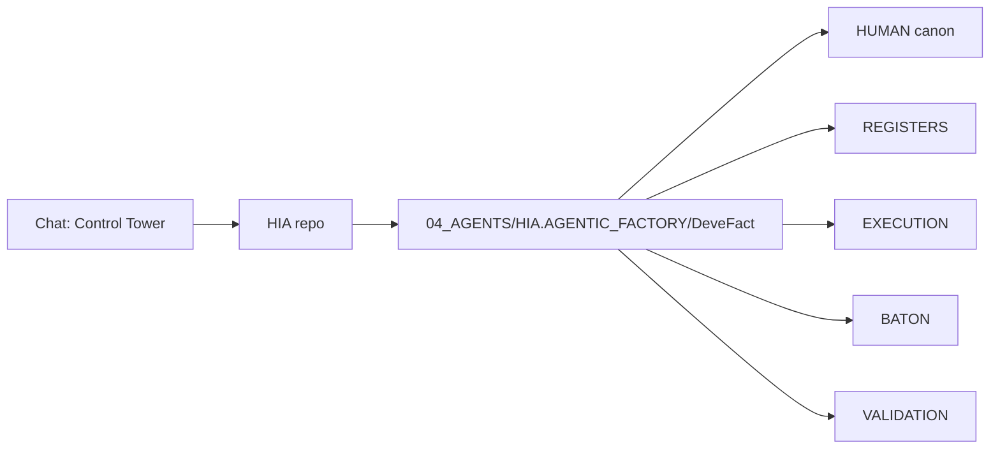

==========
HUMAN.DIAGRAMS
==========
STATUS: BATCH_0002_DRAFT

01.00_HIGH_LEVEL_FLOW

```mermaid
flowchart TD
  H[Human idea or need] --> O[IA Orchestrator]
  O --> Q[Question loop]
  Q --> D[Definition and decisions]
  D --> B[Batch up to 6 READY tasks]
  B --> E[IA Executor]
  E --> T[TOVS_SUMMARY evidence]
  T --> R[Registers updated]
  R --> H
```

02.00_BLOCKER_FLOW

```mermaid
flowchart TD
  T[Task] --> C{Blocked?}
  C -- No --> Done[DONE evidence]
  C -- Yes --> P[Park blocker]
  P --> O[Options A/B/C]
  O --> Rec[Expert recommendation]
  Rec --> H[Human decision]
  H --> Next[Resume or revise batch]
```

03.00_STORAGE_MODEL

```mermaid
flowchart LR
  Chat[Chat: Control Tower] --> HIA[HIA repo]
  HIA --> DF[04_AGENTS/HIA.AGENTIC_FACTORY/DeveFact]
  DF --> Human[HUMAN canon]
  DF --> Reg[REGISTERS]
  DF --> Exec[EXECUTION]
  DF --> Baton[BATON]
  DF --> Val[VALIDATION]
```